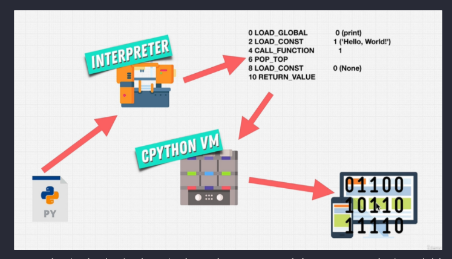
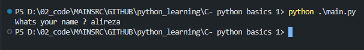
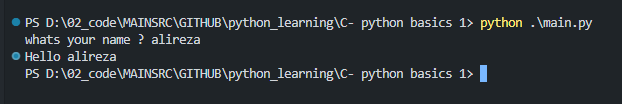
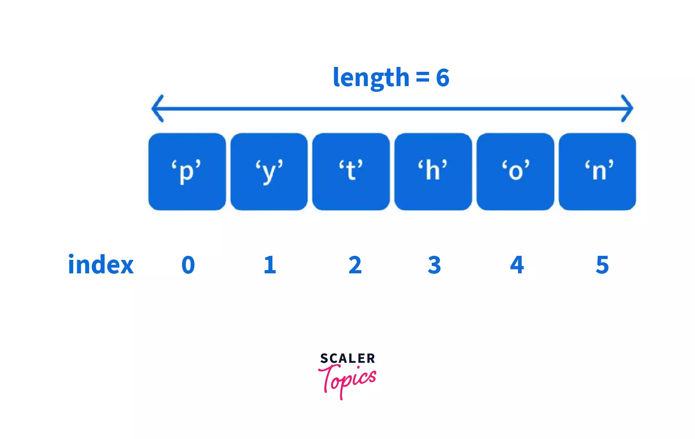
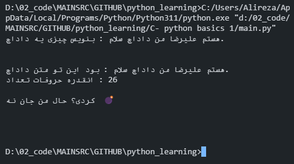

## نکته:

> **مشارکت کننده های مختلفی ممکنه روی این کتاب کار بکنن و نکات تخصصی تری رو بنویسن تا از دانش دوستان بهره مند بشیم. از همینجا عمیقا از دوستان مشارکت کننده معذرت میخوام که برای شروع نام خودمو بردم. کوچیک شما هم هستم ❤ .**

---

## معرفی نویسنده:

خب سلام سلام. من علیرضا فاضلی هستم ، الان که این کتاب یا اگه بشه بهش گفت کتاب رو وقتی مینویسم که هجده سالمه ، حالا بعدا بزرگتر میشم :) .
بنده حدود سه سالی هست که برنامه نویسی کار میکنم و توی حوزه های مختلف برنامه نویسی کار کردم ، اولش که صبح تا شب گیم میزدم مثل تمامی همسن و سالای خودم ، بعدش یکی از رفقا گفت یک زبان برنامی نویسی هست به نام پایتون بشین یادش بگیر خیلی باحاله ، اقا ما نشستیم یادش گرفتیم . مدتی باهاش کار کردیم تا اینکه وارد پروژه ای با دوست خوبم [سجاد عبدالهی](https://github.com/sajjadabd)
شدم. و اونجا منو با JavaScript آشنا کرد و خلاصه یکسالو نیمی رفتم برای خودم که با جی اس کار کنم. حالا که رسیده به این زمان علاقه پیدا کردم که برم سمت هوش مصنوعی و بینایی کامپیوتر .

## چیشد که دارم این کتابو مینویسم ؟

خب پیشنیاز اولیه یادگیری هوش مصنوعی ، زبان برنامه نویسی پایتون هستش ، من برای خودم دوره آموزشی پایتون از وبسایت [Zero To Mastery](https://zerotomastery.io/)
انتخاب کردم. من همیشه عادت دارم که کوچکترین چیزیو که یاد میگیریم بیام توی دفترم بنویسم ، ولی این بار با خودم گفتم پسر یکم اپدیت بشو توی این قضیه . تصمیم گرفتم نکاتی که یاد میگیرم رو روی نرم افزار [Notion](https://notion.so)
بنویسم. اومدم صفحه یادگیری نوشنم رو پابلیک کردم تا بقیه دوستان هم بیان نظرشونو بگن و توی این مطلب کمکم بکنن و توی توییتر توییتش کردم ، تا اینکه دوست عزیزم
[محمد زرچی](https://github.com/mzarchi)
بهم گفت که چرا توی گیتهاب نمیزاریش تا بقیه راحت تر بتونن توش مشارکت داشته باشن ، با خودم گفتم فکر خوبیه و این شد که الا توی گیتهاب در خدمتتون هستیم.

### بدون مقدمه بریم یکم پایتون بخونیم 😁.

### تاریخچه

زمینه یادگیری عمیق هر چیزی شناخت تاریخچه و اهداف و علت های ساخت اون چیزه

پایتون که امروز به یه زبان همه منظوره و مفسری شناخته میشه که اولین بار در سال 1991 عرضه شد
نویسنده پایتون گیدو ون راسوم (Guido van Rossum) است که متولد 1956 و اهل هلند است

### علت نام گذاری پایتون

نام زبان برنامه‌نویسی پایتون از علاقه نویسنده آن به کمدین
بریتانیایی معروف، مونتی پایتون (Monty Python)، گرفته شده است.
گویدو ون راسوم، نویسنده این زبان برنامه‌نویسی، به خاطر علاقه خود به
این برنامه تلویزیونی کمدی و همچنین برای جذب توجه ویژه‌ای به این زبان،
از نام "پایتون" برای نامگذاری این زبان استفاده کرد.

### محبوبت و قدمت

بر خلاف نظر اکثریت که فکر می کنند پایتون زبان جدیدیه، پایتون یه زبان نسبتا قدیمی حساب میشه
علت این افکار عموما به این بر میگرده که پایتون توی سال های اخیر تازه بر سر زبان ها افتاده و تونسته جای خودش رو در صدر جدول برای چند سالی نگه داره

برای مثال جاوااسکریپت (JavaScript) سال 1995 عرضه شد 5 سال بعد از پایتون

روبی(Ruby) هم سال 1995 عرضه شد

سی شارپ(C#) سال 2001 عرضه شد

جولیا(Julia) سال 2012 عرضه شد

گو(Go) سال 2009 عرضه شد

### چرا پایتون؟

عموما پایتون زبانی سطح بالا با سینتکس راحت و خوانا نزدیک به زبان انسان است برای همین می تونه گزینه خوبه برای شروع برنامه نویسی باشه
و همچنین با توجه به محبوبیت و رشد پایتون و همچنین پکیج های زیادی که داره میتونه یه انتخاب مناسب برای شروع و کار در فیلد های مختلف باشه

---

### چرا اینهمه زبان برنامه نویسی داریم ؟

زبان های برنامه نویسی مثل ابزار های مختلف برای ساخت یک خونه میمونن مثل انبر ، چکش ، اره ، بیل ، کلنگ. هر کدوم از اینا برای کاری ساخته شدن ، مثلا با چکش نمیشه چاله کند.

به عنوان مثال زبان پایتون یک زبان با سرعت پایین هستش و High level. ما میخوایم برای سخت افزارمون برنامه نویسی بکنیم و سرعت برنامه سخت افزاری ما باید زیاد باشه . ما نمیتونیم از زبانی مثل پایتون که به سخت افزار نزدیک نیست و توی این مورد سرعت پایینی داره استفاده بکنیم پس میایم از زبان اسمبلی یا سی استفاده میکنیم.

زبان پایتون یک زبونیه که بهره وری رو بالاتر میبره به دلیل راحتی در کد و نزدیک بودن به زبان انگلیسی سرعت توسعه رو خیلی بالا میره.

به طور خلاصه هر زبونی رو بهر کاری ساختن و هر زبونی توی یک سری کارها بهتر از بقیه زبون هاست.

---

> accountability = مسئولیت
> instructions = دستور عمل
> gibberish = بیهودگی
>
> > valuable = hard to acquire

### نکته : همیشه بالای مطلبی معانی زبانی هستن که نوشتم ، این معانی خیلی توی دنیای کامپیوتر استفاده میشن پس به دردتون میخوره .

---

زبان ماشین به صورت اعداد باینری (0 و 1) و یا بیت ها نوشته میشود. زبانی هست که فقط کامپیوتر (مدار های کامپیوتر) میفهمه و میتونه برنامه های مارو اجرا بکنه. و زبان های برنامه نویسی که ما باهاشون کار میکنیم و جوری طراحی شدن که برای ما قابل فهمه مثل زبان های برنامه نویسی پایتون ، جاوااسکریپت ، پایتون ، گولنگ ....
زبان های میانی بین زبان ماشین و زبان انسان هستن . به خاطر همینه که ما راحت به حروف انگلیسی میتونیم برنامه های مختلف بسازیم وگرنه پوستمون کنده میشد.

**زبان های Low level** : زبان هایی هستن که به زبان ماشین نزدیک تر هستند مثل c , c++ , assembly ... .

**زبان های High Level** : زبان هایی که به زبان انسان نزدیک تر هستند ، مثل : python , JavaScipt ....

#### به طور خلاصه :

زبان سطح بالا به زبان هایی گفته میشه که به زبان ما انسان ها نزدیکه و درکش برای ما اسون و در عوض برای کامپیوتر سخته ولی زبان های سطح پایین برعکس برای ما سخت ولی برای کامپیوتر اسونه!

---


**Translator:** وظیفه مترجم اینه که زبان برنامه نویسی که ما باهاش کد میزنیم رو به زبان ماشین ترجمه بکنه ، به عنوان مثال ما داریم پایتون کد میزنیم و به پایتون میگیم که یه متنی رو برای من چاپ بگیر ، کامپیوتر نمیفهمه که من توی زبان پایتون چی نوشتم ، میگه که این چرتو پرت چیه تحویل من میدی ، اینجاست که مترجم ها وارد کار میشن و و اون چرت و پرت رو برای کامپیوتر به زبان ماشین ترجمه میکنن و کامپیوتر حالا میگه که اها داداش تو میخوای واست یه متنیه چاپ بگیرم ، بیا اینم متنت .

#### انواع Translator ها :

1. compiler

کار کامپایلر به این صورت هستش که میاد کد های مارو از اول و تا آخر میخونه اگر مشکلی ، اروری چیزی نداشت میاد کد مارو تبدیل به فایل اجرایی میکنه مثلا فایل .exe ، و هر سری برای اجرای این برنامه نیاز نیستش از اول این کد کامپایل بشه و دوبارخ فایل اجرایی جدید برای اجرا ساخته بشه ولی تا زمانی که بخواید توی کدتون تغیری ایجاد کنید ، اونموق دوباره نیازه که کدتون کامپایل بشه و خب سرعت زبان های کامپایلری از زبان های interpreter یا همون مفسری بیشتر . به عنوان مثال زبان های : C++ , C# , Java زبان های کامپایلری هستند.

1. interpreter

مفسر میاد خط به خط کدامون رو میخونه و اگر اون خط مشکلی نداشت خروجی همونو بهمون میده و مفسر هیچ فایل اجرایی نداره چون کامپایل نمیشه و داره ترجمه میشه پس در نتیجه برای هربار اجرا باید این روند رو طی بکنه و همین موضوع سرعتش رو پایین میره !. زبان مفسری مثل : python , PHP , JavaScript , Ruby.

---

### برنامه نویسی به صورت انلاین

شما برای برنامه نویسی به صورت انلاین ( فقط برای یاگیری ) میتونید از
وبسایت های زیر استفاده کنید:

- [Glot.io](https://glot.io)
- [Repl.it](https://repl.it)

---

```py
print(’hello world’)
```

این دستور توی پایتون برای ما هر چی که بخوایم رو در درون ترمینال برای ما خروجی میگیره. این ساده ترین دستور درون پایتونه . به طور تخصصی به این اینا میگن سینتکس و این سینتکس ها از قبل درون زبان برنامه نویسی پایتون قرار داده شدند.

---

### نحوه تفسیر شدن کد پایتونی به زبان ماشین

<p align="center"></p>

اول از همه ما کدی رو که توی پایتون مینویسم مثل همین `print('hello world')`
، این به مفسر پایتون داده میشه
و بعدش اون مفسری که از قبل براش نوشتن ، میاد کد مارو به بایت کد ترجمه میکنه و اون بایت کد درون ماشین مجازی زبان سی به نام cpython قرار میگیره
و اون ماشین مجازی ، بایت کد مارو به زبان ماشین تبدیل میکنه :) .

---

```py

input('Whats your name ?')

```

این تابع یا فعلا بهتره از لفظ تابع استفاده نکنیم ، چون زوده یکم ، بهتره بگیم این کد ، کارش اینه که میاد از ما ورودی دریافت میکنه ، از کجا ؟
خب از ترمینال ما ، همونجایی که ما کد پایتونیمون رو خروجی میگیریم.
به مثال زیر دقت کنید:




اگه دقت کنید میتونید ببینید ، از ما پرسیده که اسمت چیه ؟ خب من جواب دادم علیرضا. ولی این اسم نه جایی ذخیره شده نه حرکتی زده شده مثلا بیاد بگه سلام علیرضا.

باید چیکار بکنیم ؟ اینو توی یک متفیر ذخیره بکنیم ، وقتی چیزی رو توی متفیر ذخیره میکنیم این توی مموریما میره و ذخیره میشه و ما میتونیم با این کار های مختلف بکنیم.

```py

userName = input('whats your name ? ')

print('Hello ' + userName)

```





و حالا میبینید که ما تونستیم از این تابع input استفاده بکنیم ، یک ورودی از کاربر دریافت بکنیم و اون ورودی رو درون متغیر بریزیم و از اون متغیر به عنوان خروجی استفاده بکنیم .

---

# Python.3 vs Python.2

> evolving = درحال تکامل | decided = تصمیم گرفت | legacy = میراث

### breaking changes :

به اپدیتی گفته میشه که وقتی میاد دیگه اپلیکیشن ها برنامه ها و پروژه ها نمیتونن از اون اپدیت استفاده بکنن چون اصلا براشون طراحی نشده. به عنوان مثال وقتی پایتون 3 اومد دیگه شرکت ها نمیتونستن خودشونو تا مدت ها اپدیت بکنن و باید خط به خط پروژه هاشونو اپدیت میکردن. یعنی همه چی برای شرکتا ف\*\*اکداپ شده بود 😂.

از سال 2008 سازنده پایتون تصمیم گرفت که ورژن جدید پایتون رو بسازه یعنی ورژن 3 که انقلابی در کامیونیتی پایتون بودش و اینکه اومد کلا تمامی زیرساخت های زبان پایتون رو از نو کوبید و ساخت باعث breaking changes شد.

### نمونه ای از کد های پایتون 2 و 3 :

```py
#python 2 :
print ‘hello world’

#python 3 :
print(’hello world’)

```

---

### Python Data Types - انواع داده در زبان پایتون

> data = داده | type = نوع | fundamental = بنیادی ، اساسی

اول بزار لیستی از دیتا تایپ های تو پایتون، توی پایتون رو بهت معرفی بکنم، فقط میخوایم به اسمشون اشنا بشیم:

- ### Fundamental Data Types :

1. int

```py
myAge = 18
```

1. float

```py
myMoney = 3.9
```

1. str

```py
myName = "Alireza Fazeli"
```

1. bool

```py
single = True
```

1. list
1. tuple
1. set8
1. dict

- ### Custom Data Types

کلاس ها نمونه ای از دیتا تایپ های شخصی سازی شده هستند.

> جلوتر به صورت تخصصی کلاس رو یاد میگیریم، فعلا فقط گوش ما باهاش اشنا بشه.

- ### Specialized Data Types :

> جلوتر به صورت تخصصی این بخش رو یاد میگیریم، فعلا فقط گوش ما باهاش اشنا بشه.

ماژول ها نمونه ای از دیتا تایپ های خاص در پایتون هستنید

- ### None

---

## چی میشه که ما بتونیم به راحتی از راحتی متغیرمون استفاده بکنیم

خب ، مثلا فکر کنید میخواید یه برنامه بسازید ، که عملایت بعلاوه تو ریاضی رو انجام بده و ما میخوایم از مقدار قبلی توی متغیر استفاده بکنیم ، یکم گیج شدید 😂؟ منم گیج شدم بیا کدشو ببین :

```py

numberOne = 2

numberOne = 2 + 3

```

کد بالارو نگاه کنید ، الان من میخوام از همون متغیر برای مقدار دهی استفاده کنم و متغیر جدیدی نیام نسازم. اما الان تو کد بالا ما اومدیم چرتو پرت نوشتیم ، اخه دو بعلاوه سه ؟ پس مقدار قبلی متغیر رو چجوری بگیریم ؟
به روش زیر :

```py

numberOne = 2

numberOne  = numberOne + 3

```

به همین اسونی تونستیم مقدار قبلی متغیر رو توی همون متغیر بریزیم و یک عملایت جدید انجام بدیم . ولی میتونیم این کار رو خیلی راحت تر انجام بدیم ، یک عملی هست که توی تمام های زبان های برنامه نویسی هستش ، اسم تخصصیش میشه : _augmented assignment operator_ حالا حفظم نکردی نکردی این اسمو مهم نیست 😂😂.

```py

numberOne = 2

numberOne += 3

```

خب این یعنی همون قطعه کد قبلی ولی ساده تر، اگه بخوام بگم میشه : نامبر وان بعلاوه مساوی هست با 3 . ایم سو خارجی 😎.

---

## استرینگ ها در زبان پایتون (آش رشته های برنامه نویسی )

> string = رشته |

آش رشته های برنامه نویسی، یا همون استرینگ ها (string).
خب ما توی زبان های به متن ها میگیم استرینگ که معنی فارسیش میشه رشته. چرا ؟ چون حروف ها مثل رشته بهم دیگه وصل شدن، توی دنیای کامپیوتر هرکدوم این حروف یک کد باینری مخصوص خودشو داره و اینا وقتی بهم وصل میشن بهشون میگن استرینگ.

##### ما توی زبان برنامه نویسی پایتون به سه روش میتونیم از استرینگ ها استفاده کنیم :

تک کوت : (Single Quote)

```py

myName = `alireza`

```

دابل کوت : (Double Quote) :

```py

myName = "Alireza"

```

لانگ استرینگ (Long String) :
این برای چیه ؟ خب ما وقتی بخوایم متنی بلندی رو در زبان پایتون چاپ بگیریم میتونیم از لانگ استرینگ استفاده بکنیم. شما اقایون و خانوما نمیتونید از سینگل کوت و دابل کوت برای نوشتن متن های چند خطی استفاده بکنید.
بریم که از لانگ استرینگ استفاده کنیم :

```py


hayedeMusic = '''
مـیگن مستی گناه به انگشت ملامت بایـد مستـها رو حد زد به شلاق ندامت

سبوی ما شکستـه در مـیکده بستـه امـیـد همه ی ما به همت تـو بستـه
'''

```

اقا هایده گوش بدید موقع کد زدن، حلال حلاله 😂😂.


---

> concatenation = الحاق | first name = اسم کوچک | last name = فامیلی |

## الحاق رشته ها (Strings Concatenation) :

**_خداوکیلی تبدیل این کلمات تخصصی سخته به فارسی. تا جایی که بشه سعی میکنم تبدیلشون بکنم ولی یکجایی نمیشه خدایی ._**

ما یکجا هایی نیاز داریم که دوتا استرینگ رو بهم وصل بکنیم ، مثلا من دوتا متغیر دارم که یکیش اسم من و یکیش فامیلیه منه ، خب برای اینکار باید چیکار بکنم که توی یک استرینگ بیان ؟ باید از عملی استفاده بکنیم به نام string concatenation که از عملگر ریاضی بعلاوه میاد. کد زیر رو نگاه کنید ، چیز خاصی ندار اصلا :

```py

firstName = 'alireza'
lastName = 'fazeli'

fullName = firstName + lastName

# خروجی  : alirezafazeli
# برای اینکه بتونیم متنمون رو خوشگل تر بکنیم میتونیم از متن های دیگه استفاده بکنیم :

fullName = 'Name :' + ' ' + firstName + ' . ' + 'last name :' + ' ' + lastName

# حواستون هست که باید fullName رو پرینت بگیرید ؟

print(fullName)

# خروجی : Name : alireza . last name : fazeli


```

---

## الحاق رشته ها به روش حرفه ای ها !
خب برای اینکه بخوایم رشته رو به هم الحاق کنیم یا از متغیر ها توی رشته هامون استفاده بکنیم، واقعا سخته که بیایم هی از عملگر  ریاضی **(+)** استفاده کنیم. پس بریم با روش خیلی خفن پایتون 3 استفاده کنیم :) .

---

## Formatted String ( F string ):

ما میتونیم در پایتون بدون اینکه نیازی باشه از عملگر برای الحاق رشته استفاده بکنیم ، میتونیم از چیزی به نام **F String** استفاده کنیم.

```py
first_name = "alireza"
last_name = "fazeli"
full_name = f"Your Full Name Is : {first_name} - {last_name}"

print(full_name) 

# خروجی
# Your Full Name Is : alireza - fazeli
```


به همین سادگی ما میتونیم از متغیر ها در رشته هامون استفاه بکنیم و نیازی نداریم که سختی بکشیم.
اول از f  در اول استرینگمون استفاده میکنیم ، و بعد هرجایی که نیاز بود یه پرانتز باز میکنیم و متغیرمون رو درونش قرار میدیم .

___

> Function : تابع
## تابع های ریاضی (Math Functions) : 

> بزارید اول از همه یک چیزی رو بگم، ما قرار نیست تو پایتون یا هر زبان برنامه نویسی دیگه همه چیز رو یاد بگیریم، بلکه قرار چیزهایی رو یاد بگیریم که مورد نیازمونه و هرچیزی رو که نمیدونیم بریم سرچ بزنیم چون همه چیز کف اینترنت ریخته و ما نیاز داریم که پایه های کار رو بدونیم . 😃

> یک نکته دیگه رو هم بگم اینکه فعلا کار به این نداشته باشید که تابع چیه چون که جلوتر مفصل دربارش حرف میزنم، فعلا فقط بدونید که تابع مثل یک کارخونست، یک ورودی بهش میدی و اون نسبت به اون ورودی بهت یک محصولی رو ارائه میده 💣.


## round() : 

این تابع از اسمش معلومه کارش چیه، اعداد رو برای ما روند میکنه یا گرد میکنه. این تابع اگه اعداد اعشاری، اعشارشون از پنج کمتر باشه، میاد رو به پایین گرد میکنه و اگه پنج یا بالاتر از پنج باشن، رو به بالا گرد میکنه. مثلا عدد 3.5 میشه 4 و عدد 3.4 میشه 3.


```py
print(round(3.5)) # خروجی : 4
print(round(3.4)) # خروجی : 3
```

## abs() : 

این فانکشن میاد علامت پشت یه عدد رو، بر میداره و برای ما خود اون عدد رو بر میگردونه به عنوان مثال اگه ما عدد (-8) داشته باشیم، این  میاد (-) بر میداره و عدد 8 رو بر میگردونه.
```py
print(abs(-8)) # خروجی : 8 
```

---
> Efficient : کارآمد ، موثر   |  Precedence : تقدم ، اولویت

## Operator Precedence (اولویت عملگرهای ریاضی) : 

در پایتون عملگر های ریاضی یک اولویت بندی دارن، دقیقا مثل ریاضی. به عنوان مثال شما قراره یک محاسباتی رو انجام بدین خب باید بدونید وقتی که دارید این محسبات رو انجام میدید بر چه اساسیه و اولویت های اون چی هستن.
به ترتیب میریم جلو : 

**1- () ** : 
خب پرانتز اولویت اول رو داره و هرچیزی که درون پرانتز قرار بگیره اولویت اول رو داره. دقیقا تمام این اولویت ها مثل ریاضی که یادگرفتین هستن.

**2- ** ** : 
توان ! . این عملگر همون توان در ریاضیات هستش ، با استفاده از این عملگر هر عددی رو میتونیم به توان عدد دیگری برسونیم.

```py
print(2 ** 2) # دو به توان دو
# خروجی : 4
```

**3 - * ** : 
ضرب ! . اولویت بعدی با ضرب هستش.

```py
print(2 * 2) # دو ضرب در دو
# خروجی : 4
```

**4- / ** : 
تقسیم ! . اولویت بعدی با تقسیم هستش ما میتونیم با این عملگر هر عددی رو تقسیم بر عدد دیگری کنیم.

```py
print(8 / 2) # هشت تقسیم بر دو
# خروجی : 4 
```

**5- + **:
بعلاوه ! . خب بعلاوه بعلاوست دیگه 😂.

```py
print(2 + 2) # دو بعلاوه دو
# خروجی : 4 
```

**6- ( -  )** :
منها ! .
```py
print(8 - 2) # هشت منها  دو
# خروجی : 6 
```


---
> sensitive : حساس | Variable : متغیر |  Dynamic : پویا  | Constant : ثابت 

## متغیر ها (Variable) : 
خب ما درباره متغیر ها یکم حرف زدیم.  و حالا دقیق تر ببینیم متغیر ها چی هستن؟
متغیر ها مثل ظرف هایی هستن که داده های مارو نگهداری میکنن. به عنوان مثال کابری توی سایت من ثبت نام میکنه ، من کجا باید اسمشو نگهداری کنم و نشونش بدم؟ توی متغیر !. و خب این متغیر ها کجا ذخیره میشن؟ هر وقت که پروژمون رو ران میکنیم درون مموری کامپیوتری یه گوشه  ای رو برای خودشون رزرو میکنن و داده هارو نگهداری میکنن.
به صورت کلی تر، متغیر ها با یک آدرسی در یک جای مموری، فضایی رو اشغال میکنن تا value های مارو یا همون مقدار های ما یا داده های مارو درون اون فضا قرار بدن تا ما بتونیم در پروژمون ازش استفاده بکنیم.

### چجوری میتونیم از یک متغیر استفاده بکنیم؟ به صورت زیر : 
```py

user_name = "alireza fazeli" 
# یک اسمی برای متغیر انتخاب کردیم و یک مقداری رو ریختیم توش. اسم متغیر من user_name هست .
# و مقدار من alirezafazeli
```

> پایتون یک  زبان dynamic type هستش. یعنی نیازی نیستش که ما برای اینکه متغیر تعریف کنیم به پایتون بگیم که آقا من قراره توی تو بیام استرینگ بریزم یا اینتیجر بریزم. پایتون کاری به این کارا نداره ! میگه هرچی دل تنگت میخواهد بریز تو من 😂.

### Case sensitive : 
پایتون یک زبان حساس به نوع نوشتاری متغیر هستش ، یعنی اینکه متغیر به نام : iq با iQ فرق داره و اگه متغیری با این دو نوع نوشتاری تعریف بکنی باهم دیگه فرق دارن، پس در نتیجه حواستون باشه ! .

###  Constants : 
به متغیر هایی در زبان برنامه نویسی گفته میشه که قرار نیست هیچوقت مقادیر درونش تغییر بکنه.
به عنوان مثال عدد پی یک عدد همیشه ثابته و اون عدد : 3.14 هستش. پس در نتیجه اگه من بخوام متغیری به نام عدد پی داشته باشم این هیچوقت قرار نیست تغییر بکنه و من به عنوان یک برنامه نویس باید منظورمو یک جوری به برنامه نویس های دیگه برسونم ! با چه روشی؟ به روش زیر : 

روش اول : در این روش اگه ما نام متغیرمون به صورت حروف بزرگ بنویسیم یا به اصطلاح upper case یعنی داریم میگیم که اون متغیر Constant هستش ! .
```py 
PI = 3.14 # این یکی متغیر ثابت هستش
```

روش دوم :  اگه دو خط تیره به اول متغیرمون اضافه بکنیم یعنی داریم میگیم که این متغیر ثابت یا constant هستش.

```py
__PI = 3.14
```

---

## مقدار دهی متغیر در یک خط !
شاید براتون جاب باشه ولی ما میتونیم چندین متغیر رو در یک خط مقدار دهی بکنیم و نیاز نباشه بیایم برای هر متغیر در هر خط مجزا مقدار دهی بکنیم.

```py

a, b, c = 1, 2, 3

# a = 1
# b = 2
# c = 3

```


در این روش همونطوری که ما به ترتیب اومدیم اسم متغیر هارو نوشتیم همونجوری به ترتیب باید مقدار دهی بکنیم که متغیر اولی مقدارش میشه همون عدد اولی.
به همین آسونی !

---


## Type Conversion  : 

شاید براتون سوال باشه که آیا ما میتونیم نوع داده هارو به یکدیگر تبدیل بکنیم یا نه ؟
مثلا یک استرینگ '3' رو آیا میتونیم به اینتیجر 3 تبدیل کنیم ؟ باید بگم بله این امکان پذیره !

### تابع Type :
ما با استفاده از تابع type در زبان برنامه نویسی پایتون میتونیم بفهمیم که آقا نوع این داده ما چی هستش به عنوان مثال برنامه به ما میگه خروجی شما عدد 100 هستش ! آیا این عددی که داری به من میدی 100 از نوع استرینگ هستش ("100") یا از نوع اینتیجر (100) ؟! با استفاده از این تابع ما میتونیم این موضوع رو بفهمیم.

```py
number_one = 100
number_two = '100'
user_name = 'alireza fazeli'
is_married = True


print(type(number_one)) # خروجی : int
print(type(number_two)) # خروجی : str
print(type(user_name)) # خروجی : str
print(type(is_married))  # خروجی : bool
```


### تبدیل داده ها به string : 
ما میتونیم هر داده ای رو با استفاده از تابع string تبدیل بکنیم به نوع داده string کنیم.
به عنوان مثال من در کد زیر میخوام عدد 100 رو که از نوع داده اینتیجر هستش رو به استرینگ تبدیل کنم .

```py

number_one = 100
number_two = str(number_one)
print(number_two) # خروجی : 100
print(type(number_two)) # حروجی : str

```


### تبدیل داده ها به int : 
ما میتونیم هر داده ای رو با استفاده از تابع int تبدیل بکنیم به نوع داده int کنیم .
به عنوان مثال من در کد زیر میخوام عدد "100" رو که از نوع داده string هستش رو به int تبدیل کنم .
این تابع هم کاراییش دقیقا مثل بالایی هستش فقط با این تفاوت که نوع تبدیل داده فرق میکنه.

```py

number_one = "100"
number_two = int(number_one)
print(number_two) # خروجی : 100
print(type(number_two)) # حروجی : int

```


---

## Escape Sequences : 

این مورد مثل جادو میمونه، ما  میتونیم از یکسری ورد های جادویی توی استرینگ هامون استفاده بکنیم .
به طور کلی Escape Sequences ها یکسری دستور عمل یا دستور هستن که فرم استرینگ مارو تغیر میدن.

به عنوان مثال اگه من بخوام از دوتا تک کوتیشن یا دوتا دابل کوتیشن توی کدم استفاده بکنم نمیشه.
من نمیتونم مثل کد زیر از استرینگ ها استفاده بکنم.
چرا؟ اگه دقت بکنید میبینید اگه مات در درون یک کوتیشن از یک کوتیشن دیگه استفاده بکنیم انگار داریم دوتا استرینگ مجزا تعریف میکنیم و پایتون گیج میشه و میگه داداش داری چیکار میکنی ؟ 🤷‍♂️😐

```py
"This is Alireza Fazeli From "Iran" " # ارور میده ❌

'This is  Alireza Fazeli From 'Iran' ' # ارور میده ❌

```

>  یادتون نره برنامه نویس ها جادوگر هستن و  میتونن جادو بکنن. پس بریم جادوگری یاد بگیریم.
>

### ( \ ) : 

بک اسلش ! اگه از همین اسلش ساده توی کدتون استفاده بکنید دارید به پایتون میگید که که بعد از اسلش هر چیزی اومد رو یک استرینگ در نظر بگیر نه یک دستور ناشناخته. شل کن پایتون جان :)

```py

quote = "This Is Alireza Fazeli From \"Iran\" " # دیگه اروری نمیده و دابل کوتیشن های مارو به عنوان یک استرینگ شناخت نه به عنوان دو استرینگ مجزا !
```

### ( \t ) : 

 وقتی (بک اسلش تی) توی استرینگ استفاده بشه، میاد از هرجایی که استفاده شده ، به اندازه یک تب (Tab) برای ما فاصله میندازه.

```py

music  = "کفتر کاکل به سر \t وای فای"
print(music) # خروجی : کفتر کاکل به سر          وای فای

```

### ( \n ) : 

وقتی از این دستور در درون استرینگمون بیایم استفاده بکنیم ، میاد از هرجایی که استفاده شده میپره رو خط جدید  ادامه استرینگ رو از خط جدید ادامه میده. معنی \n  یعنی new line هستش.

```py

music = " Nazi naz kon ke nazet \n ye sarve naze "
print(music)


# خروجی :  Nazi naz kon ke nazet 
# ye sarve naze 

```


---

## String Index : 
یکی از بخش های جذاب با جادوگری های جذاب همین بخش string index هستش. 
به طور کلی و ساده میشه گفت که استرینگ ها از حروف تشکیل شدن و این حروف ها هم در مموری جایگاهی دارن. مثلا حرف a  از جمله alireza در مموری یک ادرسی و جایگاهی داره که ما میتونیم بهش دسترسی داشته باشیم. و با این حروف و اون استرینگ بازی بکنیم یا یکسری استفاده ها بکنیم.

خب چجوری میتونیم به این حروف دسترسی داشته باشیم؟ اول از همه باید گفت شمارش در برنامه نویسی از عدد 0 هستش.
پس وقتی ما بخوایم به خونه یک در یک استرینگ دسترسی داشته باشیم باید از عدد 0 استفاده بکنیم.

#### ایندکس : 
به جایگاه های هر خونه از اون استرینگ ایندکس گفته میشه که از عدد صفر شروع میشه . حالا این ایندکس جاهای دیگه ای غیر استرینگ ها هم استفاده میشه که مهم ترین استفاده اش در  list ها هستش. جلوتر به این موضوع می پردازیم.



بریم چندتا مثال حل بکنیم !

#### مثال : 
ما میخوایم به حروف a از کلمه alireza دسترسی داشته باشیم.
برای این منظور باید به صورت زیر عمل کنیم.

```py

name = "alireza"
print(name[0]) # ایندکس صفر برابر هستش با حروف اول این استرینگ

# خروجی : a


# ----------------------------


print(name[3]) 
# خروجی : r

```

#### انتخاب بخشی خاص از یک استرینگ : 
حالا ما میتونیم بخش خاصی از یک استرینگ رو به راحتی برش بزنیم و بگیریم تو مشتمون.
برای این منظور اول بهش میگیم که از کدوم ایندکس شروع بشه تا کدوم ایندکس ادامه داشته باشم.

```py

name = "alireza fazeli"
print(name[0:7])

# خرجی : alireza

```

نکته که ای که باید در نظر داشته باشید اینه که وقتی دارید ایندکس دوم رو وارد میکنید باید یک عدد بیشتر وارد بکنید .

#### انتخاب حروف بر اساس گام :
ما میتونیم حروف رو در string index وقتی برش میدیم و انتخاب میکنیم ، بر اساس گام ها باشه. مثلا حروف دوتا دوتا بره یا سه تا تا بره جلو تا به اون ایندکس مقصد برسه.
بزارید اینجور بگم که مثلا من گفتم که از ایندکس 20 تا 50 یک استرینگ رو برای من بگیر و بیار. حالا میتونم بهش بگم وقتی داری میری از ایندکس 20 تا 50 میاری در این فاصله به صورت چندتا چندتا بیاری؟ 

بریم کد رو ببینیم تا بفهمیم : 

```py

quote = "123456789"

print(quote[0:6:2])

# خروجی : 135

```

بهش گفتم که از ایندکس 0 تا ایندکس 6 رو به صورت یکی درمیون برام بگیره و بیاره. که از عدد 1 تا 5 اگه ما یکی در میون بریم جلو، اعداد 1 ، 3 ، 5 برای ما در میاد.


> # [start : stop : over]
> # [گام : پایان : شروع]


<br>
<br>

#### خالی گذاشتن ایندکس : 
ما در string index اگه خونه ای ایندکسمون رو خالی بزاریم در واقع داریم یک معنی خاصی رو به زبان پایتون میرسونیم.

- اگه خونه اول رو خالی بزاریم یعنی از ایندکس صفر شروع بکن. 
- اگه خونه دوم رو خالی بزاریم یعنی اخرین خونه ایندکس ما . مثل اگه 10 تا ایندکس داشته باشیم ، خالی گذاشتن به معنای عدد 10 هستش.
- خونه سوم اگه خالی بشه یعنی یک یکی به صورت عادی ایتم های درون استرینگ رو جلو بره. 


---


> immutability : تغییر ناپذیری | greet : تبریک گفتن ، سلام دادن


##  Immutability : 

یکی از بحث های بسیار مهم بحث immutability در زبان پایتون هستش که باید درکش بکنید.
استرینگ ها در زبان پایتون تغییر ناپذیر هستند. به عنوان مثال ما میتونیم محتوای یک متغیر رو تغییر بدیم :
```py

name = "alireza"
print(name)
# خروجی : alireza

name = "sasan"
print(name)
#خروجی : sasan

```

ولی نمیتونیم محتوای ایندکس یک استرینگ رو تغییر بدیم. به عنوان مثال من اگه یک استرینگ به نام 'alireza' تعریف کرده باشم، دیگه نمیتونیم بیام مثلا حروف اول علیرضا که a هستش رو تبدیل بکنم به z . 
این مورد در زبان برنامه نویسی پایتون غیر امکان پذیره که ما ساختار یک استرینگی رو تغییر بدیم.
ما با استرینگ ها نمیتونیم به شکل زیر رفتار بکنیم : 

```py 

name = "alireza"
name[0] = "z" # امکان تغییر ساختار یک استرینگ وجود نداره !
print(name) # خروجی : TypeError: 'str' object does not support item assignment 

```

ما فقط میتونیم محتوای درون یک متغیر رو تغییر بدیم که تو مثال قبلی دیده بودید. تنها راه تغییر یک استرینگ اینه که ما یک استرینگ جدید ایجاد بکنیم یا به اصطلاح، produce بکنیم.
جلوتر درباره این موضوع صحبت میکنیم.

---

#### len() : 

این یک تابع built in یا از پیش ساخته شده در زبان پایتون هستش که کارایی های بسیار زیادی داره.
ما میتونیم با استفاده از این تابع، هر چیزی که قابل اندازه گیری باشه رو اندازه گیری بکنیم.
با استفاده از این تابع ما میتونیم تعداد آیتم های درون یک لیست ، آرایه ، دیکشنری ... ،  یا استرینگ رو بفهمیم.
منظور از تعداد آیتم های یک استرینگ همون تعداد حروف یک استرینگ هستش. مثلا کلمه alireza از چند حروف تشکیل شده !؟ .

نکته : تابع len میاد مثل یک انسان عادی برای با از 1 میشماره، نه صفر. حواستون باشه خلاصه !

بریم ببینیم چجوری کار میکنه : 

```py

name = "alireza"
last_name = "fazeli"
greet = "Ye Toop Daram Ghel ghelie !"

print(len(name)) # خروجی : 7
print(len(last_name)) # خروجی : 6
print(len(greet)) # خروجی : 27

```

---

## پروژه تمرینی ( محسابه گر استرینگ ) : 

میخوایم باهم یک پروژه تمرینی بزنیم و یکم کیف کنیم 😁. اول از همه میخوایم از کاربر یک ورودی بگیریم، بعدش بیایم تعداد مقادیر استرینگ ورودی کاربر رو محاسبه بکنیم و بعد به کاربر بگیم که داداش ، این متن تو ، این تعداد مقادیر تو، حالشو ببر دیگه.
سعی کنید این مور رو خودتون انجام بدید.
اگه دادید چه خوب ، اگه نتونستید سورس کد پایین رو ببینید که کامل انجامش دادم.

```py

get_input = input("داداچ یه چیزی بنویس : ")
calc_input = len(get_input)

show_msg = f"""

داداچ متن تو این بود : {get_input}
تعداد حروفات انقدره : {calc_input}

نه جان من حال کردی؟  💣


"""

print(show_msg)

```


#### خروجی : 



---


