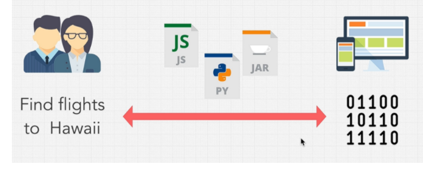

## نکته:

> **مشارکت کننده های مختلفی ممکنه روی این کتاب کار بکنن و نکات تخصصی تری رو بنویسن تا از دانش دوستان بهره مند بشیم. از همینجا عمیقا از دوستان مشارکت کننده معذرت میخوام که برای شروع نام خودمو بردم. کوچیک شما هم هستم ❤ .**

---

## معرفی نویسنده:

خب سلام سلام. من علیرضا فاضلی هستم ، الان که این کتاب یا اگه بشه بهش گفت کتاب رو وقتی مینویسم که هجده سالمه ، حالا بعدا بزرگتر میشم :) .
بنده حدود سه سالی هست که برنامه نویسی کار میکنم و توی حوزه های مختلف برنامه نویسی کار کردم ، اولش که صبح تا شب گیم میزدم مثل تمامی همسن و سالای خودم ، بعدش یکی از رفقا گفت یک زبان برنامی نویسی هست به نام پایتون بشین یادش بگیر خیلی باحاله ، اقا ما نشستیم یادش گرفتیم . مدتی باهاش کار کردیم تا اینکه وارد پروژه ای با دوست خوبم [سجاد عبدالهی](https://github.com/sajjadabd)
شدم. و اونجا منو با JavaScript آشنا کرد و خلاصه یکسالو نیمی رفتم برای خودم که با جی اس کار کنم. حالا که رسیده به این زمان علاقه پیدا کردم که برم سمت هوش مصنوعی و بینایی کامپیوتر .

## چیشد که دارم این کتابو مینویسم ؟

خب پیشنیاز اولیه یادگیری هوش مصنوعی ، زبان برنامه نویسی پایتون هستش ، من برای خودم دوره آموزشی پایتون از وبسایت [Zero To Mastery](https://zerotomastery.io/)
انتخاب کردم. من همیشه عادت دارم که کوچکترین چیزیو که یاد میگیریم بیام توی دفترم بنویسم ، ولی این بار با خودم گفتم پسر یکم اپدیت بشو توی این قضیه . تصمیم گرفتم نکاتی که یاد میگیرم رو روی نرم افزار [Notion](https://notion.so)
بنویسم. اومدم صفحه یادگیری نوشنم رو پابلیک کردم تا بقیه دوستان هم بیان نظرشونو بگن و توی این مطلب کمکم بکنن و توی توییتر توییتش کردم ، تا اینکه دوست عزیزم
[محمد زرچی](https://github.com/mzarchi)
بهم گفت که چرا توی گیتهاب نمیزاریش تا بقیه راحت تر بتونن توش مشارکت داشته باشن ، با خودم گفتم فکر خوبیه و این شد که الا توی گیتهاب در خدمتتون هستیم.

### بدون مقدمه بریم یکم پایتون بخونیم 😁.

> accountability = مسئولیت
> instructions = دستور عمل
> gibberish = بیهودگی
>
> > valuable = hard to acquire

### نکته : همیشه بالای مطلبی معانی زبانی هستن که نوشتم ، این معانی خیلی توی دنیای کامپیوتر استفاده میشن پس به دردتون میخوره .

---

زبان ماشین به صورت اعداد باینری (0 و 1) و یا بیت ها نوشته میشود. زبانی هست که فقط کامپیوتر (مدار های کامپیوتر) میفهمه و میتونه برنامه های مارو اجرا بکنه. و زبان های برنامه نویسی که ما باهاشون کار میکنیم و جوری طراحی شدن که برای ما قابل فهمه مثل زبان های برنامه نویسی پایتون ، جاوااسکریپت ، پایتون ، گولنگ ....
زبان های میانی بین زبان ماشین و زبان انسان هستن . به خاطر همینه که ما راحت به حروف انگلیسی میتونیم برنامه های مختلف بسازیم وگرنه پوستمون کنده میشد.

**زبان های Low level** : زبان هایی هستن که به زبان ماشین نزدیک تر هستند مثل c , c++ , assembly ... .

**زبان های High Level** : زبان هایی که به زبان انسان نزدیک تر هستند ، مثل : python , JavaScipt ....

#### به طور خلاصه :

زبان سطح بالا به زبان هایی گفته میشه که به زبان ما انسان ها نزدیکه و درکش برای ما اسون و در عوض برای کامپیوتر سخته ولی زبان های سطح پایین برعکس برای ما سخت ولی برای کامپیوتر اسونه!

---

**Translator:** وظیفه مترجم اینه که زبان برنامه نویسی که ما باهاش کد میزنیم رو به زبان ماشین ترجمه بکنه ، به عنوان مثال ما داریم پایتون کد میزنیم و به پایتون میگیم که یه متنی رو برای من چاپ بگیر ، کامپیوتر نمیفهمه که من توی زبان پایتون چی نوشتم ، میگه که این چرتو پرت چیه تحویل من میدی ، اینجاست که مترجم ها وارد کار میشن و و اون چرت و پرت رو برای کامپیوتر به زبان ماشین ترجمه میکنن و کامپیوتر حالا میگه که اها داداش تو میخوای واست یه متنیه چاپ بگیرم ، بیا اینم متنت .

#### انواع Translator ها :

1. compiler

کار کامپایلر به این صورت هستش که میاد کد های مارو از اول و تا آخر میخونه اگر مشکلی ، اروری چیزی نداشت میاد کد مارو تبدیل به فایل اجرایی میکنه مثلا فایل .exe ، و هر سری برای اجرای این برنامه نیاز نیستش از اول این کد کامپایل بشه و دوبارخ فایل اجرایی جدید برای اجرا ساخته بشه ولی تا زمانی که بخواید توی کدتون تغیری ایجاد کنید ، اونموق دوباره نیازه که کدتون کامپایل بشه و خب سرعت زبان های کامپایلری از زبان های interpreter یا همون مفسری بیشتر . به عنوان مثال زبان های : C++ , C# , Java زبان های کامپایلری هستند.

1. interpreter

مفسر میاد خط به خط کدامون رو میخونه و اگر اون خط مشکلی نداشت خروجی همونو بهمون میده و مفسر هیچ فایل اجرایی نداره چون کامپایل نمیشه و داره ترجمه میشه پس در نتیجه برای هربار اجرا باید این روند رو طی بکنه و همین موضوع سرعتش رو پایین میره !. زبان مفسری مثل : python , PHP , JavaScript , Ruby.

---
